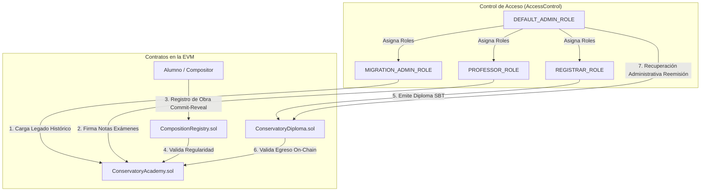

# 🎼 Decentralized Music Academy Ledger (DMAL)

> **Trabajo Práctico Integrador — Tecnologías DLT, Contratos Inteligentes y Blockchain**  
> _UTN · ISI 5to Año_

Ecosistema descentralizado basado en contratos inteligentes diseñado para resolver problemáticas críticas de seguridad documental y propiedad intelectual en instituciones de enseñanza artística superior (Conservatorios de Música).

---

## 🎯 1. Problemáticas Resueltas

1.  **Falsificación e Inseguridad de Credenciales:** Auditoría y seguimiento inmutable de notas, materias y diplomas de egreso, eliminando la vulnerabilidad y la dependencia de servidores de bases de datos locales centralizados.
2.  **Plagio e Inseguridad de Propiedad Intelectual:** Registro temporal temprano y descentralizado de obras musicales (PDFs de partituras, audios WAV/MP3) mediante hashes criptográficos enlazados a la red IPFS (Proof of Existence).
3.  **Gestión de Excepciones y Transición Histórica:** Puente controlado de importación de legados históricos Web2 sin alterar la inmutabilidad de los flujos orgánicos de firmas docentes en producción.

---

## 🏗️ 2. Arquitectura de Contratos Inteligentes

El sistema DMAL opera sobre la EVM y se compone de tres contratos inteligentes principales acoplados mediante llamadas cruzadas (Cross-Contract Calls) y un estricto control de acceso basado en roles (`AccessControl` de OpenZeppelin):



---

## 💻 3. Componentes Técnicos (Solidity)

Los archivos fuente están ubicados en la carpeta [`contracts/`](contracts/):

### A. [`ConservatoryAcademy.sol`](contracts/ConservatoryAcademy.sol)

Módulo centralizador de la vida académica de la institución.

- **Optimización de Storage (Gas Packing):** Los registros de exámenes se empaquetan en una estructura `SubjectRecord` de **9 bytes** que ocupa un único slot de storage de la EVM, reduciendo un 65% el costo de gas en escrituras (`SSTORE`).
- **Mapeo de Carreras On-Chain:** Almacena la currícula obligatoria y evalúa en caliente si un alumno completó el plan de estudios (`hasCompletedAllSubjects`), eliminando arrays redundantes dinámicos para mayor consistencia de estado.
- **Módulo de Migración Histórica:** Habilita un período excepcional controlado (`migrationPeriodActive`) para la carga de registros Web2 por lotes, clausurándose de manera irreversible post-transición.

### B. [`CompositionRegistry.sol`](contracts/CompositionRegistry.sol)

Gestor de registros de propiedad intelectual descentralizada.

- **Mitigación de Front-Running (Commit-Reveal):** Flujo de dos transacciones independientes. El alumno envía primero un hash secreto del compromiso. Una vez minado el bloque, revela los datos crudos de su obra. Esto anula plagios en tránsito de transacciones expuestas en el mempool.
- **Tarifación Dinámica:** Los alumnos regulares registran sus obras de forma gratuita, mientras que los externos pagan una tasa mutable modificable por la gobernanza (`FEE_SETTER_ROLE`).
- **Retiro Seguro (Safe Withdrawal):** Los fondos recaudados se retiran mediante llamadas de bajo nivel `.call` protegiendo al contrato de bloqueos accidentales de gas.

### C. [`ConservatoryDiploma.sol`](contracts/ConservatoryDiploma.sol)

Expide diplomas inalterables como **Soulbound Tokens (SBT)** heredando el estándar ERC-721.

- **Bloqueo de Transferencias:** Inhabilita las funciones `transferFrom` y `safeTransferFrom` anulando mercados secundarios de diplomas universitarios.
- **Acuñación Inteligente:** Llama cross-contract a la Academia para validar el egreso del alumno en tiempo de ejecución.
- **Mecanismo de Recuperación de Llaves (`burnAndReissue`):** Ante robo o pérdida de claves de la wallet del graduado, la administración (`RECOVERER_ROLE`) puede invalidar (quemar) el diploma comprometido y reacuñarlo bajo un **nuevo Token ID incremental** a una wallet segura, garantizando la trazabilidad histórica de eventos.

---

## 🛠️ 4. Documentación de Setup, Uso y Testing

Esta guía está pensada para ejecutar la entrega completa en **Remix VM**, sin depender de un backend ni de una red pública. Los contratos usan Solidity `^0.8.20` y las librerías oficiales de **OpenZeppelin Contracts v5**.

### 4.1. Estructura del Repositorio

```text
contracts/
  ConservatoryAcademy.sol      # Historial académico, currículas, roles y migración de wallets
  CompositionRegistry.sol      # Registro commit-reveal de obras musicales y retiro de ETH
  ConservatoryDiploma.sol      # Diplomas SBT ERC-721 no transferibles
artifacts/                     # ABIs y metadata generados para integración externa
README.md                      # Documentación funcional y técnica del proyecto
```

### 4.2. Setup en Remix

1. Abrir [Remix IDE](https://remix.ethereum.org/).
2. Crear la carpeta `contracts/` y cargar los tres archivos `.sol` del repositorio.
3. En **Solidity Compiler**, seleccionar una versión compatible con `0.8.20` o superior dentro de la rama `0.8.x`.
4. Activar **Auto compile** o compilar manualmente cada contrato.
5. Si Remix no resuelve los imports de OpenZeppelin automáticamente, instalar o importar `@openzeppelin/contracts` versión 5.x.
6. En **Deploy & Run Transactions**, elegir el entorno **Remix VM**.

### 4.3. Setup Local Opcional

El repositorio incluye una configuración mínima de Hardhat para compilar y ejecutar tests automatizados.

Instalar dependencias:

```bash
npm install
```

Compilar:

```bash
npm run compile
```

Ejecutar tests:

```bash
npm test
```

Foundry sigue siendo una alternativa posible, pero el repositorio no incluye configuración Foundry por defecto.

### 4.3.1. Tests Automatizados por Cuenta

La suite de Hardhat automatiza el flujo usando signers fijos, equivalentes a cuentas de Remix VM:

| Cuenta Hardhat     | Rol                                                                              |
| ------------------ | -------------------------------------------------------------------------------- |
| `admin`            | Despliega contratos, define currícula, matricula, emite diplomas y retira fondos |
| `professor`        | Firma notas académicas                                                           |
| `student`          | Recibe notas, registra composición y recibe diploma SBT                          |
| `recoveryWallet`   | Recibe diploma reemitido                                                         |
| `externalComposer` | Registra una composición pagando tasa                                            |
| `treasury`         | Recibe fondos retirados                                                          |

Los tests verdes cubren flujos válidos de academia, diplomas SBT, registro commit-reveal, reemisión y retiro de fondos. Los tests rojos cubren permisos insuficientes, currícula incompleta, transferencias bloqueadas del SBT, reveal inválido, fee incorrecto y retiros inválidos.

### 4.4. Orden de Despliegue

Usar la cuenta administradora como `Account 0`.

1. Desplegar `ConservatoryAcademy`.
   - Constructor: `_initialAdmin = Account 0`.
2. Desplegar `CompositionRegistry`.
   - `_academyContract = dirección de ConservatoryAcademy`.
   - `_initialFee = 1000000000000000` para una tasa de ejemplo de `0.001 ETH`.
   - `_admin = Account 0`.
3. Desplegar `ConservatoryDiploma`.
   - `_academyContract = dirección de ConservatoryAcademy`.
   - `_admin = Account 0`.

### 4.5. Configuración Inicial de Roles

Desde `Account 0`, asignar roles con `grantRole(bytes32 role, address account)` heredado de `AccessControl`.

Roles útiles:

```text
PROFESSOR_ROLE         = keccak256("PROFESSOR_ROLE")
REGISTRAR_ROLE        = keccak256("REGISTRAR_ROLE")
RECOVERER_ROLE        = keccak256("RECOVERER_ROLE")
MIGRATION_ADMIN_ROLE  = keccak256("MIGRATION_ADMIN_ROLE")
ISSUER_ROLE           = keccak256("ISSUER_ROLE")
FEE_SETTER_ROLE       = keccak256("FEE_SETTER_ROLE")
```

Para la prueba mínima:

1. `Account 0`: admin y registrador.
2. `Account 1`: profesor.
3. `Account 2`: alumno.
4. `Account 3`: wallet nueva para recuperación.

Asignaciones necesarias:

1. En `ConservatoryAcademy`, asignar `PROFESSOR_ROLE` a `Account 1`.
2. En `ConservatoryAcademy`, asignar `RECOVERER_ROLE` a la dirección desplegada de `ConservatoryDiploma`.
   - Esto es necesario porque `burnAndReissue` llama internamente a `migrateStudentWallet`, y para `ConservatoryAcademy` el `msg.sender` de esa llamada es el contrato de diplomas.
3. Si se prueba la migración histórica, asignar `MIGRATION_ADMIN_ROLE` a la cuenta que ejecutará `importHistoricalRecords`.

### 4.6. Flujo de Uso Principal

1. Definir una carrera:
   - Contrato: `ConservatoryAcademy`.
   - Función: `defineCurriculum(1, [0, 1, 2])`.
2. Matricular un alumno:
   - Desde `Account 0`.
   - Función: `enrollStudent(Account 2, 1)`.
3. Cargar notas aprobadas:
   - Desde `Account 1`.
   - Ejecutar:
     - `submitGrade(Account 2, 0, 80, 101)`.
     - `submitGrade(Account 2, 1, 75, 101)`.
     - `submitGrade(Account 2, 2, 90, 101)`.
4. Validar egreso:
   - Función: `hasCompletedAllSubjects(Account 2)`.
   - Resultado esperado: `true`.
5. Emitir diploma SBT:
   - Desde `Account 0`.
   - Contrato: `ConservatoryDiploma`.
   - Función: `mintDiploma(Account 2, legajoHash)`.
   - `legajoHash` puede ser cualquier `bytes32`, por ejemplo el hash de un legajo académico.
6. Registrar una composición musical:
   - Desde `Account 2`.
   - Calcular `commitHash = keccak256(abi.encodePacked(ipfsHash, Account 2, salt))`.
   - Ejecutar `commitComposition(commitHash)`.
   - Minar al menos un bloque o ejecutar otra transacción antes del reveal.
   - Ejecutar `registerComposition(ipfsHash, titulo, salt)` con `msg.value = 0`, porque el alumno activo no paga tasa.
7. Reemitir diploma por recuperación de wallet:
   - Desde `Account 0`.
   - Verificar primero que `ConservatoryDiploma` tenga `RECOVERER_ROLE` en `ConservatoryAcademy`.
   - Ejecutar `burnAndReissue(Account 2, Account 3, tokenId)`.
   - Resultado esperado: el SBT viejo se quema, se emite un nuevo `tokenId` a `Account 3` y la wallet activa del alumno pasa a ser `Account 3`.
8. Retirar fondos acumulados de externos:
   - Desde `Account 0`.
   - Contrato: `CompositionRegistry`.
   - Función: `withdrawFunds(tesoreria)`.

### 4.7. Testing Manual en Remix VM

Probar el flujo con al menos tres cuentas distintas:

| Cuenta      | Rol                          | Acciones                                                              |
| ----------- | ---------------------------- | --------------------------------------------------------------------- |
| `Account 0` | Admin / registrador / emisor | Despliega, define currícula, matricula, emite diploma y retira fondos |
| `Account 1` | Profesor                     | Firma notas con `submitGrade`                                         |
| `Account 2` | Alumno                       | Recibe notas, registra obra y recibe diploma SBT                      |
| `Account 3` | Wallet de recuperación       | Recibe el diploma reemitido en prueba de contingencia                 |

Casos positivos:

1. `hasCompletedAllSubjects(Account 2)` devuelve `true` después de aprobar todas las materias.
2. `mintDiploma(Account 2, legajoHash)` emite `DiplomaIssued`.
3. `commitComposition` seguido de `registerComposition` emite `CompositionRegistered`.
4. `burnAndReissue(Account 2, Account 3, tokenId)` emite `DiplomaReissued` y migra la wallet en `ConservatoryAcademy`.

Casos negativos:

1. Intentar `mintDiploma` antes de aprobar toda la currícula debe revertir con `CurriculumIncomplete`.
2. Intentar emitir un segundo diploma al mismo graduado debe revertir con `DiplomaAlreadyIssued`.
3. Intentar transferir el SBT con `transferFrom` o `safeTransferFrom` debe revertir con `SBTTransferLocked`.
4. Intentar `registerComposition` en el mismo bloque del commit debe revertir por la protección commit-reveal.
5. Intentar `withdrawFunds` sin balance debe revertir con `NoFundsToWithdraw`.

### 4.8. Checklist de Entrega

| Requisito                                               | Evidencia en el repo                                                                                                                                     |
| ------------------------------------------------------- | -------------------------------------------------------------------------------------------------------------------------------------------------------- |
| Al menos una función en Contrato 1 llama a Contrato 2   | `ConservatoryDiploma` llama a `ConservatoryAcademy` con `hasCompletedAllSubjects` y `migrateStudentWallet`; `CompositionRegistry` llama `activeStudents` |
| Todas las funciones públicas tienen NatSpec             | Los contratos documentan `@notice`, `@param` y `@return` cuando corresponde                                                                              |
| Al menos una función con ETH implementa CEI             | `registerComposition` y `withdrawFunds` separan checks, effects e interactions                                                                           |
| Existe al menos un modifier de acceso                   | `onlyRole(...)` de OpenZeppelin protege funciones administrativas                                                                                        |
| Eventos declarados y emitidos correctamente             | `GradeSubmitted`, `CompositionRegistered`, `DiplomaIssued`, `DiplomaReissued`, entre otros                                                               |
| Al menos un custom error en vez de `require` con string | `SBTTransferLocked`, `CurriculumIncomplete`, `NoFundsToWithdraw`, etc.                                                                                   |
| Funciones de lectura usan `view` o `pure`               | `hasCompletedAllSubjects`, `supportsInterface`, getters públicos                                                                                         |
| Flujo completo probado con 3+ cuentas en Remix VM       | Seguir el plan de testing manual de la sección 4.7                                                                                                       |

---

## 📍 5. ROADMAP de Prueba

Para obtener una guía **paso a paso detallada** del flujo completo de emisión de diploma, incluyendo validaciones, cross-contract calls, eventos y costos de gas estimados:

👉 **[Ver: Hoja de Ruta de Diploma (DIPLOMA_FLOW_ROADMAP.md)](DIPLOMA_FLOW_ROADMAP.md)**

Este documento incluye:

- ✅ 5 pasos detallados (Carrera → Matriculación → Calificaciones → Verificación → Diploma SBT)
- 💰 Tabla de costos de gas por función (~320K gas = ~6.4 MATIC total)
- 🔗 Diagrama de cross-contract calls (Diploma → Academy)
- 🧪 Checklist de testing manual en Remix
- 📊 Estructura de datos optimizada (SubjectRecord de 9 bytes)
- 🔐 Validaciones de seguridad implementadas

---

## 📐 6. Decisiones de Arquitectura

Para entender las **decisiones técnicas clave** detrás del diseño de los contratos:

👉 **[Ver: Nota de Decisiones de Arquitectura (ARCHITECTURE_DECISIONS.md)](ARCHITECTURE_DECISIONS.md)**

Este documento detalla:

### Decisión #1: Diplomas como Soulbound Tokens (SBT)

- ⚠️ Problema: Falsificación e inseguridad de credenciales
- ✅ Solución: Tokens no transferibles vinculados a wallet
- 🔧 Implementación: Override de `_update()` para bloquear transferencias
- 💡 Justificación: Garantiza que diplomas son prueba irrefutable de egreso
- 🔐 Mecanismo de recuperación: `burnAndReissue()` para wallet comprometida

### Decisión #2: Optimización de Storage con Gas Packing

- ⚠️ Problema: Costo prohibitivo de almacenamiento ($12M USD en escala)
- ✅ Solución: Empacar 5 slots en 1 mediante reordenamiento de tipos
- 🔧 Implementación: Estructura `SubjectRecord` de 9 bytes
- 💰 Impacto: 90% ahorro de gas (~$10.8M USD en 3,000 calificaciones)
- 📊 Ejemplos: Comparativas con y sin optimización

Cada decisión incluye:
- Contexto del problema
- Implementación técnica completa (código real)
- Ejemplos paso a paso en Remix
- Diagramas visuales
- Análisis de tradeoffs
- Métricas cuantificables

---

## 🔌 7. Integración con el Backend Administrativo Web2

Para conectar los contratos inteligentes a una infraestructura administrativa tradicional sin comprometer la velocidad ni la resiliencia del sistema:

1.  **Capa de Wrappers (Web3j / Ethers.js):** Se compilan los contratos a ABI/BIN y se generan wrappers fuertemente tipados para invocar métodos directamente desde la API sin estructurar llamadas RPC a mano.
2.  **Transactional Outbox Pattern:** Para asegurar la consistencia eventual y que no se pierdan confirmaciones de transacciones de la EVM por apagones o reinicios del servidor administrativo, las peticiones se guardan en estado `PENDING_ON_CHAIN` en una tabla outbox de PostgreSQL. Un worker asíncrono off-chain se encarga de retransmitir y monitorizar el minado real, actualizando a `CONFIRMED` una vez procesado el bloque.
3.  **Indexación Reactiva por Logs:** El backend tradicional escucha los eventos emitidos (`GradeSubmitted`, `DiplomaIssued`) para actualizar dinámicamente los tableros web de los alumnos y docentes en tiempo real.
